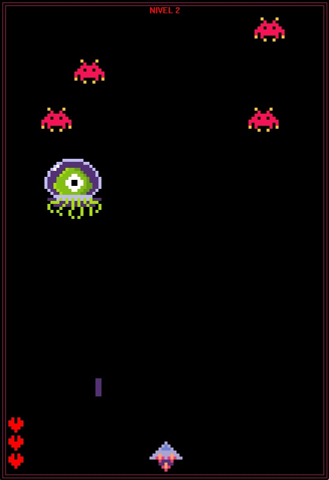

<h1 align="center">ALIEN INVADER</h1>

<h2>Herramientas utilizadas<h2>

 

<h2>Instalación<h2>

1. Clonar el repositorio o descargar el comprimido.  
2. Abrir el archivo practiceTonight.dev con el editor de código Dev-c++.
3. Presionar el boton Compile & Run o la tecla F11 que cumple la misma función.
4. Disfrutar el juego de acuerdo a las instrucciones.

<h3 align="center">
  
</h3>
